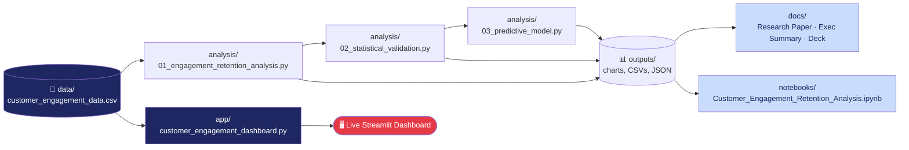

# Customer Engagement & Product Utilization Analytics for Retention Strategy


A behavioral, engagement-first analysis of customer retention for a European bank, built as part of the **Unified Mentor — Data Analyst & Data Science Internship**. This project reframes churn away from demographics and balance alone, and toward **activity, product depth, and relationship strength** as the real drivers of loyalty.

> 🚀 **[Live Streamlit Dashboard](https://customer-engagement-retention-analytic.streamlit.app/)** · [GitHub Repository](https://github.com/iqra-insights/Customer-Engagement-Retention-Analytics) · [Research Paper (PDF)](docs/Research_Paper.pdf)

## 📑 Table of Contents

- [Project Overview](#-project-overview)
- [Objectives](#-objectives)
- [Dataset](#-dataset)
- [Architecture](#-architecture--data-flow)
- [Key Findings](#-key-findings)
- [Statistical Validation](#-statistical-validation)
- [Predictive Model](#-predictive-model-honestly-reported)
- [Methodology](#-methodology)
- [Streamlit Dashboard](#️-streamlit-dashboard)
- [Jupyter Notebook](#-jupyter-notebook)
- [Project Structure](#-project-structure)
- [Deliverables](#-deliverables)
- [Tech Stack](#️-tech-stack)
- [Quick Start — All Commands](#-quick-start--all-commands)
- [Requirements Coverage](#️-requirements-coverage)
- [Uploading to GitHub](#-how-to-upload-this-project-to-github)
- [Troubleshooting](#-troubleshooting)

## 📌 Project Overview

Banks often assume that a high-balance customer is a loyal customer. This project tests that assumption against 10,000 real customer records and finds it false: **inactive customers churn at 1.88x the rate of active customers**, regardless of wealth. The analysis classifies customers into engagement profiles, quantifies the retention impact of product depth, cross-analyzes financial commitment against activity, and introduces a composite **Relationship Strength Index (RSI)** to score customer "stickiness."

## 🎯 Objectives

**Primary**
- Evaluate the relationship between engagement and churn
- Measure the retention impact of product count and product mix
- Identify disengaged yet high-value customers

**Secondary**
- Support engagement-driven retention strategies
- Improve product bundling decisions
- Reduce silent churn among premium customers

## 📊 Dataset

| Field | Description |
|---|---|
| `CustomerId`, `Surname` | Customer identifiers |
| `CreditScore` | Customer creditworthiness |
| `Geography`, `Gender`, `Age` | Demographics |
| `Tenure` | Years with the bank |
| `Balance`, `EstimatedSalary` | Financial fields |
| `NumOfProducts` | Number of bank products held (1–4) |
| `HasCrCard`, `IsActiveMember` | Binary engagement indicators |
| `Exited` | Churn indicator — target variable |

10,000 records · 3 geographies (France, Germany, Spain) · no missing values or duplicates.

## 🏗️ Architecture & Data Flow



Raw data flows through three analysis scripts (each building on the last) into `outputs/`, which feeds both the static documents in `docs/` and the standalone notebook. The dashboard reads the raw CSV directly and re-derives everything live — it has no dependency on the scripts having been run first.

## 🔑 Key Findings

| Finding | Result |
|---|---|
| Engagement Retention Ratio | Inactive members churn **1.88x** more than active members |
| Product Depth Index | Holding 2+ products reduces churn by **53.9%** vs. single-product customers |
| Counter-intuitive signal | 3–4 product holders churn at **82.7% / 100%** — a cross-sell fatigue segment |
| High-Balance Disengagement Rate | **49.9%** of Premium-balance customers are inactive |
| At-Risk Premium Customers | **1,247** customers, churning at **30.5%** |
| Sticky vs. At-Risk (RSI ≥ 6 vs. < 6) | **13.3%** vs. **22.5%** churn |

Every relationship above is statistically validated with chi-square tests of independence (all **p < 0.001**) and 95% confidence intervals — see `outputs/statistical_validation.json` and the Research Paper's Statistical Validation section.

## ✅ Statistical Validation

- **Chi-square tests of independence** — confirms each categorical relationship (engagement profile, product tier, balance tier, sticky status, geography) is statistically significant (all p < 0.001)
- **Point-biserial correlation** — ranks numeric features by linear association with churn; Age (r = 0.285) and the Relationship Strength Index (r = -0.140) are the strongest linear correlates. Number of Products shows a weak linear correlation (r = -0.048) despite a strong categorical effect, because the relationship is non-monotonic (U-shaped, not straight-line)
- **95% confidence intervals** — Active (14.27%, CI [13.31%, 15.22%]) and Inactive (26.85%, CI [25.60%, 28.10%]) churn rates do not overlap, confirming the Engagement Retention Ratio is a robust gap, not sampling noise

See `outputs/statistical_validation.json` and Section 7 of the Research Paper for full detail.

## 🤖 Predictive Model (Honestly Reported)

A logistic regression model was trained (scikit-learn, 75/25 stratified train/test split, standardized features) to test whether churn can be predicted at the individual level, and to isolate each feature's independent effect while controlling for all others:

| Metric | Value |
|---|---|
| Accuracy (test set) | 80.9% |
| Baseline accuracy (always predict "no churn") | 79.6% |
| Recall (churn class) | 19.1% |
| ROC-AUC | 0.784 |

**Honest takeaway:** the model barely beats the naive baseline and misses ~4 in 5 actual churners. This is reported as a genuine, useful finding — not hidden — because it reinforces the paper's core argument: interpretable, rule-based engagement segmentation (Section 6) separates customers far more cleanly than a single linear predictive score does. Age (odds ratio 2.06) and Germany (odds ratio 1.42 vs. France) emerge as meaningful independent risk factors once engagement and balance are controlled for — flagged as directions for follow-up, not asserted as proven causes. Full detail in `outputs/predictive_model_results.json` and Section 8 of the Research Paper.

## 🧮 Methodology

1. **Data Ingestion & Validation** — load, validate binary fields, confirm churn labeling
2. **Engagement Classification** — 4 profiles: Active Engaged, Active Low-Product, Inactive Disengaged, Inactive High-Balance
3. **Product Utilization Analysis** — churn by product count; single vs. multi-product comparison
4. **Financial Commitment vs. Engagement Analysis** — balance-tier × activity cross-analysis, salary-balance mismatch, at-risk premium detection
5. **Retention Strength Assessment** — composite **Relationship Strength Index**:

   ```
   RSI = 2 × (Active Member) + 1.5 × (Products, capped at 4) + 1 × (Has Credit Card) + 1 × (Tenure ≥ 5 years)
   ```

   Score ≥ 6 → **Sticky** · Score < 6 → **At-Risk**

## 🖥️ Streamlit Dashboard

A fully themed, brand-consistent dashboard — the same navy / ice-blue / red palette as the Research Paper and Presentation deck, not default Streamlit styling.

**🌐 [Open the Live Dashboard →](https://customer-engagement-retention-analytic.streamlit.app/)**

| Element | Color | Hex |
|---|---|---|
| Primary brand | Navy | `#1E2761` |
| Secondary panels | Navy Mid | `#2A3578` |
| Light accent | Ice Blue | `#CADCFC` |
| Risk / attention | Accent Red | `#E63946` |
| Muted text | Slate | `#6E7B9B` |

Four interactive modules:
- **Engagement vs. Churn Overview** — engagement-profile breakdown, geography distribution
- **Product Utilization Impact** — product-count churn, single vs. multi-product comparison
- **High-Value Disengaged Detector** — adjustable premium-balance threshold, at-risk customer table
- **Retention Strength Scoring** — RSI distribution, Sticky vs. At-Risk split

Filters: geography, engagement profile, product count, balance and salary thresholds. Each tab includes a plain-language insight callout and a CSV download button for the underlying summary table — nothing is locked behind a chart with no way to take the numbers with you.

### Deploying it live (Streamlit Community Cloud — free)

The dashboard only depends on `data/customer_engagement_data.csv` (loaded by relative path), `requirements.txt`, and `.streamlit/config.toml` — all already committed, so it deploys as-is with no extra setup:

1. Push this repo to GitHub (see **Upload to GitHub** below) — repo must be **public**
2. Go to [share.streamlit.io](https://share.streamlit.io) → sign in with GitHub → **Create app**
3. Select this repo, branch `main`, main file path: `app/customer_engagement_dashboard.py`
4. Click **Deploy** — you'll get a live URL like `https://your-app-name.streamlit.app` in 2–3 minutes

## 📓 Jupyter Notebook

`notebooks/Customer_Engagement_Retention_Analysis.ipynb` combines all three analysis scripts into one narrated, end-to-end notebook — data validation through the predictive model — with all charts and outputs already executed and embedded, so it renders fully on GitHub with no need to re-run it.

## 📁 Project Structure

```
Customer-Engagement-Retention-Analytics/
├── README.md
├── LICENSE
├── .gitignore
├── requirements.txt
├── .streamlit/
│   └── config.toml                            # Brand theme (navy/ice-blue/red)
├── data/
│   └── customer_engagement_data.csv
├── notebooks/
│   └── Customer_Engagement_Retention_Analysis.ipynb  # Full narrated analysis, pre-executed
├── analysis/
│   ├── 01_engagement_retention_analysis.py       # EDA, KPI computation, chart generation
│   ├── 02_statistical_validation.py              # Chi-square tests, correlations, confidence intervals
│   └── 03_predictive_model.py                    # Logistic regression: train/test, metrics, odds ratios
├── app/
│   └── customer_engagement_dashboard.py       # Streamlit dashboard (branded theme)
├── outputs/
│   ├── charts/                                # Generated chart PNGs (incl. odds-ratio chart)
│   ├── processed_customer_engagement_data.csv
│   ├── kpi_summary.json
│   ├── validation_report.json
│   ├── statistical_validation.json            # Chi-square + correlation + confidence interval results
│   ├── predictive_model_results.json          # Model metrics + odds ratios (real, held-out test results)
│   └── *.csv                                  # Summary tables per analysis step
└── docs/
    ├── Research_Paper.docx
    ├── Executive_Summary.docx
    └── Presentation.pptx
```

## 📦 Deliverables

- **Research Paper** — full EDA, methodology, findings, and recommendations (12 pages)
- **Executive Summary** — one-page stakeholder brief with headline KPIs
- **Presentation Deck** — 15-slide stakeholder walkthrough, same brand theme as the dashboard
- **Jupyter Notebook** — full narrated analysis, pre-executed with embedded outputs
- **Streamlit Dashboard** — live, filterable analytics tool, branded to match

## 🛠️ Tech Stack

Python · Pandas · NumPy · Matplotlib · Seaborn · SciPy · scikit-learn · Streamlit · Plotly · Jupyter

---

## 🚀 Quick Start — All Commands

Every command needed to get this project running, in order, for **Windows**, **macOS**, and **Linux**.

### 1. Clone the repository

```bash
git clone https://github.com/your-username/engagement-retention-analytics.git
cd engagement-retention-analytics
```

*(If you downloaded the ZIP instead of using Git, just extract it and `cd` into the folder.)*

### 2. Create a virtual environment (recommended)

**macOS / Linux:**
```bash
python3 -m venv venv
source venv/bin/activate
```

**Windows (Command Prompt):**
```cmd
python -m venv venv
venv\Scripts\activate
```

**Windows (PowerShell):**
```powershell
python -m venv venv
venv\Scripts\Activate.ps1
```

You'll know it worked because your terminal prompt will show `(venv)` at the start.

### 3. Install all dependencies

```bash
pip install -r requirements.txt
```

### 4. Run the analysis scripts (in this exact order)

```bash
python analysis/01_engagement_retention_analysis.py
python analysis/02_statistical_validation.py
python analysis/03_predictive_model.py
```

Each script prints its results to the terminal and saves outputs (charts, CSVs, JSON) into `outputs/`. They must run in this order because the second and third scripts read the processed file the first script creates.

### 5. Explore the Jupyter Notebook (optional — already pre-executed)

```bash
jupyter notebook notebooks/Customer_Engagement_Retention_Analysis.ipynb
```

This opens in your browser. All cells already have outputs saved, so you can read it without running anything — or click **Run All** to reproduce everything yourself.

### 6. Launch the Streamlit Dashboard

```bash
streamlit run app/customer_engagement_dashboard.py
```

This opens automatically at **http://localhost:8501**. Press `Ctrl+C` in the terminal to stop it.

### 7. Deactivate the virtual environment when done

```bash
deactivate
```

### One-shot copy-paste (macOS/Linux)

```bash
git clone https://github.com/your-username/engagement-retention-analytics.git
cd engagement-retention-analytics
python3 -m venv venv
source venv/bin/activate
pip install -r requirements.txt
python analysis/01_engagement_retention_analysis.py
python analysis/02_statistical_validation.py
python analysis/03_predictive_model.py
streamlit run app/customer_engagement_dashboard.py
```

---

## ✔️ Requirements Coverage

Explicit traceability against the original project brief — every required item, and where it lives in this repo:

| Brief Requirement | Delivered As |
|---|---|
| Data Ingestion & Validation | `analysis/01_engagement_retention_analysis.py` §1, `outputs/validation_report.json` |
| Engagement Classification (4 profiles) | `analysis/01_engagement_retention_analysis.py` §2, Research Paper §6.1 |
| Product Utilization Analysis | `analysis/01_engagement_retention_analysis.py` §3, Research Paper §6.2 |
| Financial Commitment vs. Engagement Analysis | `analysis/01_engagement_retention_analysis.py` §4, Research Paper §6.3 |
| Retention Strength Assessment (RSI) | `analysis/01_engagement_retention_analysis.py` §5, Research Paper §6.4–6.5 |
| Engagement Retention Ratio (KPI) | `outputs/kpi_summary.json`, Dashboard header |
| Product Depth Index (KPI) | `outputs/kpi_summary.json`, Dashboard Tab 2 |
| High-Balance Disengagement Rate (KPI) | `outputs/kpi_summary.json`, Dashboard Tab 3 |
| Credit Card Stickiness Score (KPI) | `outputs/kpi_summary.json`, Research Paper §9 |
| Relationship Strength Index (KPI) | `outputs/kpi_summary.json`, Dashboard Tab 4 |
| Engagement vs. Churn Overview (dashboard module) | Dashboard Tab 1 |
| Product Utilization Impact (dashboard module) | Dashboard Tab 2 |
| High-Value Disengaged Detector (dashboard module) | Dashboard Tab 3 |
| Retention Strength Scoring Panels (dashboard module) | Dashboard Tab 4 |
| Engagement / product-count / balance-salary filters | Dashboard sidebar |
| Research paper (EDA, insights, recommendations) | `docs/Research_Paper.docx` / `.pdf` |
| Streamlit dashboard (live analytics) | `app/customer_engagement_dashboard.py` |
| Executive summary for stakeholders | `docs/Executive_Summary.docx` |

Two items go beyond the original brief, added for extra rigor: statistical significance testing (chi-square, confidence intervals) and a supplementary predictive model — both honestly reported, including where the model underperforms simple segmentation.

## 📤 How to Upload This Project to GitHub

### If you haven't created a repository yet

1. Go to [github.com](https://github.com) → click the **+** icon (top right) → **New repository**
2. Name it `engagement-retention-analytics`, add a short description, keep it **Public**
3. **Do not** check "Add a README" / ".gitignore" / "License" — this project already includes all three
4. Click **Create repository**

### Push this project to it

```bash
cd engagement-retention-analytics
git init
git add .
git commit -m "Initial commit: Customer Engagement & Retention Analytics project"
git branch -M main
git remote add origin https://github.com/your-username/engagement-retention-analytics.git
git push -u origin main
```

Replace `your-username` with your actual GitHub username. On first push, a browser window may open asking you to log in and authorize — approve it.

### Making the repo look professional (2 minutes)

On your repo page, click the ⚙️ gear icon next to **About** and add:
- **Description:** *Customer Engagement & Product Utilization Analytics for Retention Strategy — European bank churn analysis with a branded Streamlit dashboard.*
- **Topics:** `data-analysis` `streamlit` `pandas` `scikit-learn` `churn-prediction` `python` `banking-analytics` `data-science`

### Updating the repo later

Whenever you make changes locally:

```bash
git add .
git commit -m "Describe what you changed"
git push
```

---

## 🐛 Troubleshooting

| Problem | Fix |
|---|---|
| `python: command not found` | Try `python3` instead of `python` (common on macOS/Linux) |
| `pip: command not found` | Try `pip3` instead, or `python -m pip install -r requirements.txt` |
| `streamlit: command not found` | Make sure your virtual environment is activated (Step 2), then re-run Step 3 |
| Port 8501 already in use | Run `streamlit run app/customer_engagement_dashboard.py --server.port 8502` instead |
| `git: command not found` | Install Git from [git-scm.com](https://git-scm.com/downloads) |
| Notebook shows old/blank outputs | Open it and click **Kernel → Restart & Run All** |

## 👤 Author

**Iqra** — Data Analyst & Data Science Intern, Unified Mentor

## 📄 License

Released under the [MIT License](LICENSE) — free to use, modify, and share.
